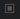
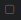
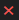
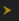
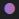
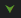
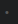
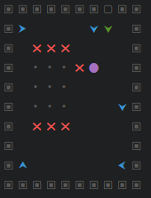
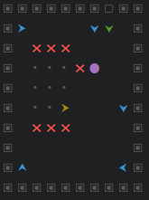

## block o automata 

To minimalistyczna gra logiczna 
opierająca się na zasadach rządzących cellular automatą.

###cel gry
celem gry jest zdobyć punkt kontrolny (najechać na niego blokiem gracza) lub wyeliminować wszystkich wrogów

###sposób gry 
Na początku rozgrywki trwa faza przygotowawcza

Gracz ma za zadanie ustawić swoje komórki na legalnych polach

gdy uzna że przygotował swoje pionki do rozgrywki, rozpoczyna się druga część rozgrywki 
tura komputera 

w turze komputera pionki przesuwają się po planszy i wchodza ze sobą w interakcje 

na tym etapie gracz nie ma kontroli nad pionkami

gracz wygrywa poprzez zdobycie celu gry 

jeżeli przed upływem ustalonej liczby iteracji cel nie zostanie zdobyty
gracz przegrywa i musi wrócić do fazy planowania 

Za każdy poziom gracz może zdobyć trzy trofea

### trofea
trofea przyzanawane są za spełnienie poniższych wymagań

- ukończenie poziomu 
- ukończenie wykożystując minimalną liczbę pionków
- ukońcenie w ograniczonej liczie iteracji  poziomu

twórca poziomu decyduje o trudności zdobywania gwiazdek

### edytor poziomów
do dyspozycji gracza oddawany jest także edytor poziomów,
narzędzie pozwalające twozyć własne łamigłówki 

### rodzaje komórek 

gra rozpoznaje 7 rodzajów komórek

i dwa typy pól 

#### ściana 
ikona:

- jest nieruchomym blokiem

#### ruchoma ściana
ikona:

- jest ruchomym blokiem
- nie może zostać zabita przez enemy cell

#### enemy
ikona:

- zabija komórki nacierające na niego 
- może byc poruszony, ale tylko za pośrednictwem ruchomej ściany 

#### move 
ikona:

- jest ruchomym blokiem
- co iteracje (jeżeli nie jest zablokowana) przesuwa się na pole komórki przed nią samą 
- jeżeli jakieś bloki stoją na drodze one także ulegną przesunięciu 
- może zostać zabita przez enemy 
- porusza się jedynie wzdłuż i wszerz poziomu 

#### direction  
ikona:

- jest nieruchomym blokiem
- obraca wszystkie nacierające na niego bloki, tak by wskazywały wyznaczony kierunek

#### goal
ikona:

- jest ruchomym blokiem
- może byc poruszony, ale tylko za pośrednictwem ruchomej ściany 
- jeżeli zostanie poruszona cel gry zostaje zaliczony a ona sama znika z planszy 

#### clone 
ikona:

- jest ruchomym blokiem
- może byc poruszony, ale tylko za pośrednictwem ruchomej ściany 
albo gdy zostanie poruszona pod kontem prostym do niej samej
    
- co iterację gry przesuwa bloki przed sobą i w miejsce przesuniętego bloku 
    wstawiana jest kopia komórki stojącej za nią samą 

#### puste pole
- pole niedostępne dla gracza, nie ma możliwości postawienia pionka na etapie przygotowania
- nie ma symbolu 

#### legalne pole 

ikona:

- na etapie przygotowania gracz ma prawo w to pole wstawić dowolną figurę 

## przykładowy poziom :

przed takim zadaniem staje gracz na początku każdej rundy
celem jest ustawienie "move" pionka tak by bezpiecznie dotarł do pola goal

rozwiązanie:

